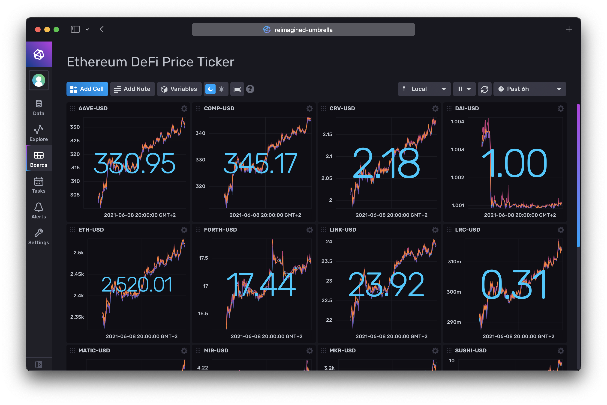

# reimagined-umbrella

[](https://www.npmjs.com/package/reimagined-umbrella)
[](https://www.npmjs.com/package/reimagined-umbrella)
[](https://github.com/leonrinkel/reimagined-umbrella/issues)
[](https://github.com/leonrinkel/reimagined-umbrella/blob/main/LICENSE)
[](https://github.com/leonrinkel/reimagined-umbrella/graphs/contributors)
[](https://github.com/leonrinkel/reimagined-umbrella/actions/workflows/node.js.yml)
[](https://github.com/leonrinkel/reimagined-umbrella/security/code-scanning)

A simple Node.js® project that subscribes to the Coinbase WebSocket API and streams ticker data into InfluxDB.

## Example Usage

```
docker build -t reimagined-umbrella .
docker run \
    --name reimagined-umbrella \
    --env INFLUX_TOKEN=... \
    --env INFLUX_URL=http://influxdb:8086 \
    --env PRODUCT_IDS=ETH-USD,YFI-USD \
    --restart always \
    --detach \
    reimagined-umbrella
```

Note: `--restart always` is required since Coinbase disconnects after some time. The program will then just exit and expect Docker to restart it. I might change the WebSocket to automatically reconnect, but for now this works as well.

## Example Dashboard


